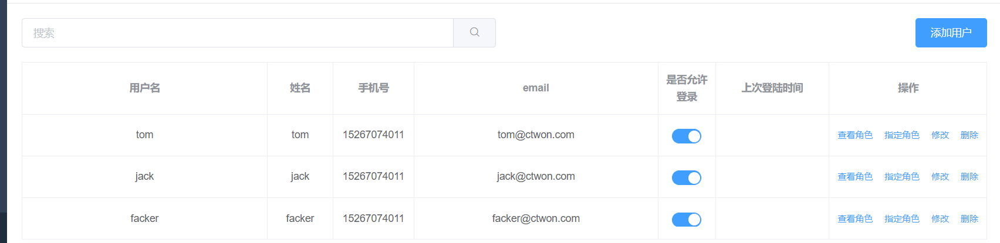
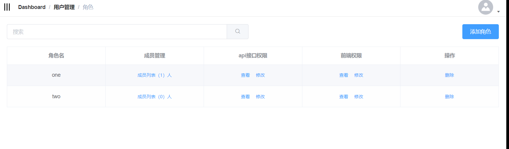
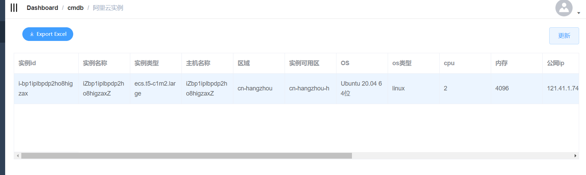

# 运维平台web

采用最新的
python  3.10.5
django  4.0.6
djangorestframework 3.13.1
进行开发

前端认证使用jwt的方式进行登录和验证

目前正在开发中
规划的功能：
1.用户权限(后接入ldap或对接钉钉等实现单点登录)

2.cmdb

3.任务调度

4.服务器批量管理(ansible)

5.sql审计

6.工单系统

7.发布系统

8.配置管理

......

完成的功能：
1. 用户的登录新增

2. 前后端分离后权限的控制

3. cmdb的实例获取

4. 配置管理-密钥管理